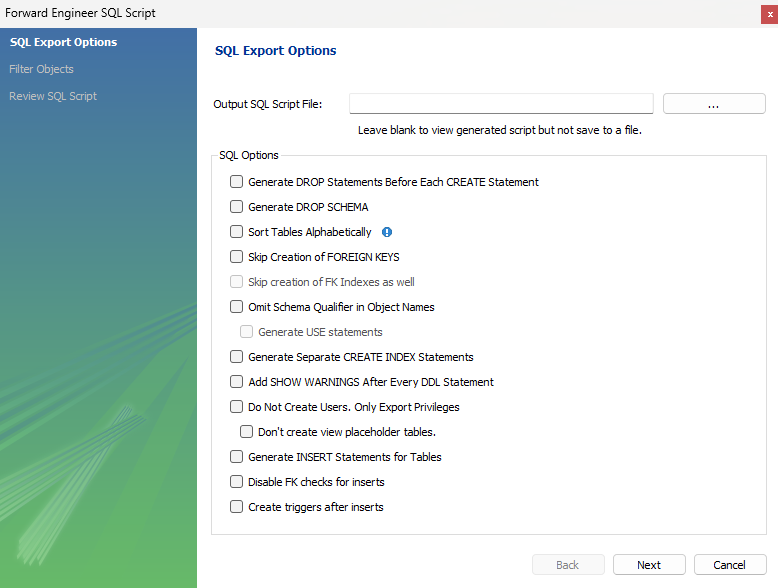
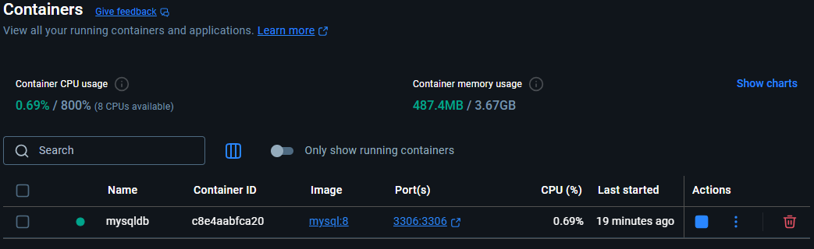
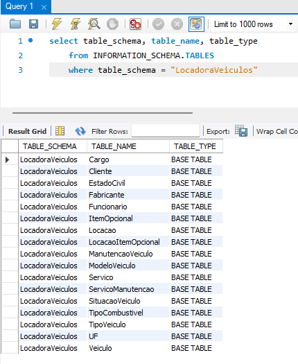

# Inserção dos Dados na Base de Dados

## Base da dados usada
A base de dados usada foi criada a partir de um script sql criado a partir do modelo fornecido.
O script foi criado através do MySQL Workbench usando o processo de Forward Engeneer como mostra a imagem abaixo.


Para o banco ser acessado foi usada a imagem oficial do MySQL 8 disponível no Docker.


E para visualizar e alterar informações no banco foram usados o MySQL Workbench e o Pentaho.

## Tabelas do banco de dados
Segue a imagem de uma consulta feita para listar as tabelas da base de dados.


## SQL de Inserção dos dados

A inserção foi dos dados na base de dados foi feita via MySQL Workbench, o script sql usado segue abaixo. Os dados também podem ser vistos no sql da base de dados.

```sql
-- ==============================
-- Inserts para tabela Cargo
-- ==============================
INSERT INTO LocadoraVeiculos.Cargo (descCargo) VALUES
('Atendente'),
('Gerente'),
('Mecânico'),
('Auxiliar Administrativo'),
('Vendedor');

-- ==============================
-- Inserts para tabela EstadoCivil
-- ==============================
INSERT INTO LocadoraVeiculos.EstadoCivil (descEstadoCivil) VALUES
('Solteiro'),
('Casado'),
('Divorciado'),
('Viúvo'),
('União Estável');

-- ==============================
-- Inserts para tabela UF
-- ==============================
INSERT INTO LocadoraVeiculos.UF (descUF) VALUES
('SP'),
('RJ'),
('MG'),
('PR'),
('RS');

-- ==============================
-- Inserts para tabela Cliente
-- ==============================
INSERT INTO LocadoraVeiculos.Cliente (nmCliente, email, celular, RG, habilitacao, cpf, dtNascimento, telefonefixo, endereco, EstadoCivil_cdEstadoCivil, UF_cdUf)
VALUES
('Carlos Silva','carlos@email.com','11988887777','1234567','A1234567','12345678901','1975-05-10','1133445566','Rua A, 100',1,1),
('Mariana Souza','mariana@email.com','21999996666','2233445','B7654321','98765432100','1988-02-15','2122223333','Rua B, 200',2,2),
('João Pereira','joao@email.com','31988887777','3344556','C1111111','45678912300','1995-07-20','3133334444','Rua C, 300',3,3),
('Fernanda Lima','fernanda@email.com','41977776666','4455667','D2222222','32165498700','2001-09-25','4144445555','Rua D, 400',1,4),
('Ricardo Gomes','ricardo@email.com','51966665555','5566778','E3333333','65498732100','2010-12-30','5155556666','Rua E, 500',4,5);

-- ==============================
-- Inserts para tabela Fabricante
-- ==============================
INSERT INTO LocadoraVeiculos.Fabricante (descFabricante) VALUES
('Toyota'),
('Honda'),
('Chevrolet'),
('Volkswagen'),
('Fiat');

-- ==============================
-- Inserts para tabela ModeloVeiculo
-- ==============================
INSERT INTO LocadoraVeiculos.ModeloVeiculo (descModelo) VALUES
('Corolla'),
('Civic'),
('Onix'),
('Gol'),
('Argo');

-- ==============================
-- Inserts para tabela TipoCombustivel
-- ==============================
INSERT INTO LocadoraVeiculos.TipoCombustivel (descCombustivel) VALUES
('Gasolina'),
('Álcool'),
('Diesel'),
('Flex'),
('Elétrico');

-- ==============================
-- Inserts para tabela SituacaoVeiculo
-- ==============================
INSERT INTO LocadoraVeiculos.SituacaoVeiculo (descSituacao) VALUES
('Disponível'),
('Alugado'),
('Em manutenção'),
('Reservado'),
('Vendido');

-- ==============================
-- Inserts para tabela TipoVeiculo
-- ==============================
INSERT INTO LocadoraVeiculos.TipoVeiculo (descTipoVeiculo) VALUES
('Sedan'),
('Hatch'),
('SUV'),
('Picape'),
('Elétrico');

-- ==============================
-- Inserts para tabela Veiculo
-- ==============================
INSERT INTO LocadoraVeiculos.Veiculo (placa, anoFabricacao, chassi, VlrDiariaBase, Fabricante_cdFabricante, TipoCombustivel_cdCombustivel, ModeloVeiculo_cdModelo, SituacaoVeiculo_cdSituacao, TipoVeiculo_cdTipoVeiculo)
VALUES
('ABC1A23', 2020, 'CHS12345678901234', 150.00, 1, 4, 1, 1, 1),
('DEF4B56', 2021, 'CHS22345678901234', 160.00, 2, 4, 2, 1, 1),
('GHI7C89', 2019, 'CHS32345678901234', 120.00, 3, 1, 3, 2, 2),
('JKL0D12', 2022, 'CHS42345678901234', 130.00, 4, 4, 4, 3, 2),
('MNO3E45', 2023, 'CHS52345678901234', 200.00, 5, 5, 5, 1, 5);

-- ==============================
-- Inserts para tabela Funcionario
-- ==============================
INSERT INTO LocadoraVeiculos.Funcionario (matricula, nmFunc, celular, cpf, telResidencial, endereco, RG, Cargo_cdCargo, UF_cdUf)
VALUES
('FUNC001','Ana Paula','11977778888','11111111111','1133112233','Rua F, 600','1234567',1,1),
('FUNC002','Bruno Rocha','21966667777','22222222222','2122113344','Rua G, 700','2233445',2,2),
('FUNC003','Carla Mendes','31955556666','33333333333','3133114455','Rua H, 800','3344556',3,3),
('FUNC004','Diego Alves','41944445555','44444444444','4144115566','Rua I, 900','4455667',4,4),
('FUNC005','Eduarda Nunes','51933334444','55555555555','5155116677','Rua J, 1000','5566778',5,5);

-- ==============================
-- Inserts para tabela ItemOpcional
-- ==============================
INSERT INTO LocadoraVeiculos.ItemOpcional (descItemOpcional, vlrAtualDiaria) VALUES
('GPS', 20.00),
('Cadeirinha bebê', 15.00),
('Wi-Fi portátil', 25.00),
('Seguro extra', 50.00),
('Suporte para bicicleta', 30.00);

-- ==============================
-- Inserts para tabela Locacao
-- ==============================
INSERT INTO LocadoraVeiculos.Locacao (dtInicio, dtFim, vlrDiaria, kmInicial, kmFinal, Veiculo_cdVeiculo, Funcionario_codFunc, Cliente_cdCliente)
VALUES
('2024-05-10','2024-05-15',150.00,10000,10200,1,1,1),
('2024-11-20','2024-11-25',160.00,20000,20300,2,2,2),
('2025-01-05','2025-01-10',120.00,30000,30150,3,3,3),
('2025-06-12','2025-06-16',130.00,40000,40200,4,4,4),
('2025-09-04','2025-09-08',200.00,50000,50300,5,5,5);

-- ==============================
-- Inserts para tabela LocacaoItemOpcional
-- ==============================
INSERT INTO LocadoraVeiculos.LocacaoItemOpcional (Locacao_cdLocacao, ItemOpcional_cdItemOpcional, vlrDiariaCobrado)
VALUES
(1,1,20.00),
(1,2,15.00),
(2,3,25.00),
(3,4,50.00),
(4,5,30.00);

-- ==============================
-- Inserts para tabela ManutencaoVeiculo
-- ==============================
INSERT INTO LocadoraVeiculos.ManutencaoVeiculo (dtSaida, dtRetorno, Veiculo_cdVeiculo)
VALUES
('2024-03-02','2024-03-05',1),
('2024-10-18','2024-10-22',2),
('2025-02-14','2025-02-18',3),
('2025-07-01','2025-07-05',4),
('2025-08-28','2025-08-30',5);

-- ==============================
-- Inserts para tabela Servico
-- ==============================
INSERT INTO LocadoraVeiculos.Servico (descServico) VALUES
('Troca de óleo'),
('Troca de pneus'),
('Alinhamento e balanceamento'),
('Revisão elétrica'),
('Troca de freios');

-- ==============================
-- Inserts para tabela ServicoManutencao
-- ==============================
INSERT INTO LocadoraVeiculos.ServicoManutencao (ManutencaoVeiculo_cdManutencao, ServicoManutencao_cdServico, dtConclusao, observacoes, custo)
VALUES
(1,1,'2024-03-05','Troca concluída com sucesso',200.00),
(2,2,'2024-10-22','Substituição de pneus',800.00),
(3,3,'2025-02-18','Alinhamento realizado',150.00),
(4,4,'2025-07-05','Revisão feita',400.00),
(5,5,'2025-08-30','Freios trocados',600.00);
```