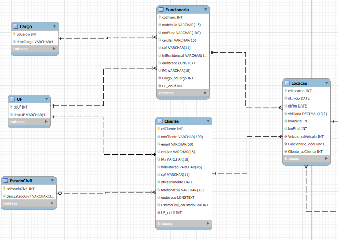
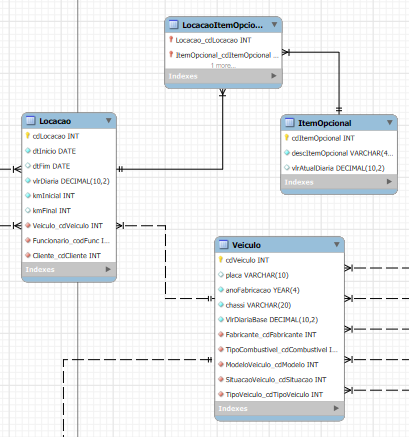
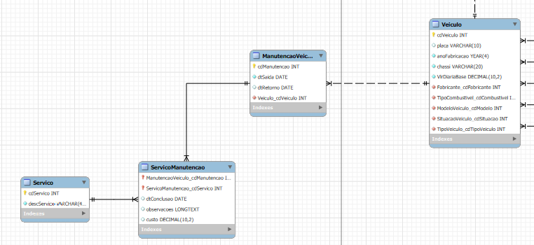
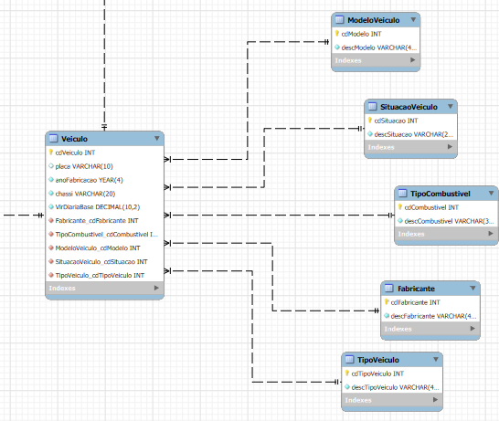

# Processos de negócio identificados
1. Aluguel de veiculos
2. Manutenção de veículos

# Exemplos de Questionamentos para os DataMarts
## Aluguel de Veículos
- Demandas de aluguéis para diferentes períodos de tempo (dia de semana, fim de semana, feriados, férias, ...).
- Quantidade de dias de locação por tipo/modelo veículo.
- Receita mensal por tipo de veículo.
- Quantidade de locação de cada item opcional para um determinado período de tempo.
- Percentual de locação com itens opcionais.
- Identificação dos itens opcionais mais requisitados por tipo de veículos alugados
- Quantia vendida por funcionário (considerando aluguel de opcionais e veículo) para um período informado.

## Manutenção de Veículos
- Custo total de manutenção por um período de tempo.
- Custo médio de manutenção por veículo.
- Custos de manutenção por tipo de serviço.
- Custo de manutenção por marca, modelo e ano do veículo
- Quais marcas/modelos têm os menores custos de manutenção?
- Quantos dias por ano cada veículo fica indisponível para manutenção?

# Diagrama
## Cliente e Funcionario (Posição: esquerda superior)

## Locação (Posição: direira superior)

## Manutenção (Posição: esquerda inferior)

## Veículo (Posição: direira inferior)
